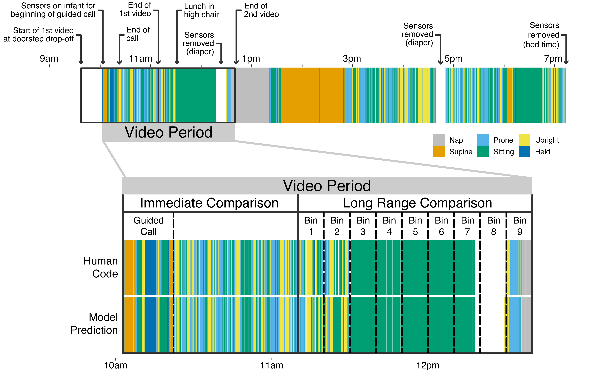

```{r setup, include = FALSE}
library(papaja)
library(knitr)
library(patchwork)
library(scales)
library(ggforce)
library(hms)
library(tidyverse)
library(lubridate)
library(rstatix)
```

```{r analysis-preferences}
# Seed for random number generation
set.seed(42)
knitr::opts_chunk$set(cache.extra = knitr::rand_seed)
pos_levels <- c("Supine", "Prone", "Sitting", "Upright", "Held")
pal <-  c("#E69F00","#56B4E9", "#009E73","#F0E442", "#0072B2") %>% 
  set_names(pos_levels)

theme_update(text = element_text(size = 14),
             axis.text.x = element_text(size = 14, color = "black"), 
             axis.title.x = element_text(size = 16),
             axis.text.y = element_text(size = 14,  color = "black"), 
             axis.title.y = element_text(size = 16), 
             panel.background = element_blank(),panel.border = element_blank(), 
             panel.grid.major = element_blank(),
             panel.grid.minor = element_blank(), axis.line = element_blank(), 
             legend.key = element_rect(fill = "white")) 

# SUBMITTED DATA IS BASED ON THE FOLLOWING IDS
#9908  9909  9910  9911 10201 10203 10204 10301 10501 10601 10701 10702 10703 10704 10802 10901 11001 11002 11004 11102 11103 11104 11202 11501 11601 11901 12001 12002 12101 12302 12303 12501 12502 13001

```

From moment to moment, infants' movements facilitate and constrain how they can interact with their surroundings. Changes in *body position*---whether infants are supine on their backs, prone on their bellies, sitting, upright, or held by a caregiver---have immediate consequences for vision, object exploration, and social interaction. When sitting and upright, infants have a better view of faces and distant objects compared to their view while in a prone position [@Freeplay; @LuoFranchak2020; @CWW]. Infants struggle to manipulate objects while supine and prone, but sitting affords object exploration [@SoskaAdolph2014]. Upright walking changes how infants and caregivers interact; while walking infants move farther away from caregivers and share toys in different ways compared to when crawling in a prone position [@ChenSchneider2022; @Karasik2011]. As infants grow older and acquire new abilities, such as independent sitting and walking, they spend more time sitting and upright and less time held, supine, and prone [@Survey; @Thurman2017; @Freeplay; @AdolphCTL2014]. Caregivers provide different learning input to infants depending on infants' body position [@KretchKoziol2022; @WestFletcher2022; @WestIverson2021; @Karasik2014]. Thus, characterizing individual differences in the day-to-day accumulation of body position experiences informs developmental theory by revealing differential opportunities for learning [@CurrentOpinion].

In this paper, we present an inertial sensing method to classify infant body position from moment-to-moment across an entire day, and validate its accuracy using over 100 hours of video recorded across 34 in-home data collection sessions. Our method takes inspiration from a more mature technology: Long-form audio recordings of infants' language experiences using wearable audio recorders. We begin by describing the impact of long-form audio recordings on research in developmental psychology, and identify the key features that should be replicated in long-form recordings of motor behavior. Next, we review the current state-of-the-art in measuring infant motor behavior---video and survey data---and their limitations in capturing real-time, full-day behavior. Finally, we discuss the advantages of using inertial sensing to classify motor behavior. Despite promising past results in brief, supervised sessions [@FranchakScott2021; @AiraksinenRasanen2020; @AiraksinenGallen2022], the current investigation takes a needed step forward by testing accuracy over long, unsupervised recordings. Although in the current investigation we focus on classification of body position, this approach can be extended to categorize other aspects of movement, such as locomotion [@AiraksinenRasanen2020] and infant-caregiver contact [@YaoPlotz2019]. 
<!-- Accompanying our paper, we have created a database [CITE] containing synchronized video and IMU data, allowing researchers to annotate and train models for behaviors beyond body position.  -->

## Inspiration from Long-Form Audio Methods

The LENA&reg; recorder is a commercial device that is worn by infants in a custom shirt pocket; the recorder has sufficient battery life and storage to record for an entire day. Closed-source LENA&reg; algorithms analyze the audio recordings to provide automatic counts of useful metrics, such as the number of words spoken by adults in the vicinity of the infant. Other long-form audio methods rely on custom-built recorders [@WassPhillips2022], apply alternative classification algorithms to LENA&reg; data [@RasanenSeshadri2020; @MichelettiYao2022], or manually transcribe audio recorded by LENA&reg; devices to improve accuracy or identify behaviors beyond the built-in categories [@Bergelson2019Corpus; @MendozaFausey2021].

Long-form audio recordings have had a transformational impact on language development research by allowing researchers to characterize opportunities for learning in daily life. For example, measuring the amount of speech heard by infants in the home [@Weisleder2013] or in a daycare setting [@PerryPrince2018] revealed how individual differences in speech input predict later vocabulary. Full-day language recording synchronized with other data sources allows researchers to identify how auditory input and vocal production interact with other processes. Beyond individual differences in aggregated data, long-form recordings can be used to determine the temporal schedule of experiences. For example, infants' daily experiences hearing music are clustered in time, with "bursty" episodes of music presence separated by relatively long periods during which music is absent [@MendozaFausey2022]. Synchronizing audio recordings with other data sources extends researchers' ability to characterize daily experiences. Linking LENA&reg; speech measurements to repeated, time-stamped text-message surveys about infant device placement revealed that infants heard less caregiver speech during periods that they were restrained in devices such as swings, exersaucers, and car seats [@MalachowskiSalo2023]. A custom-built wearable ECG and audio recorder allowed @WassPhillips2022 to discover that infant arousal increases the likelihood of infant vocalization across the day. 

We identified five key features of long-form audio methods that should be replicated in analogous studies of motor behavior. First, wearable audio recorders are *mobile*. Measurement is not limited to a particular room because the recording device travels with the participant. Data are recorded to onboard device memory, so participants do not need to be in range of a receiver. Second, wearable audio recording is *unobtrusive*. Participants' reactivity to observation, such as from a video camera, may influence behavior. For example, caregivers spoke more frequently to infants during a video-recorded portion of a home recording compared with audio-only segments captured by a LENA&reg; device [@Bergelson2019Input]. Third and fourth, recordings capture *real-time data* over a *full day*. The ability to record real-time data is vital for making inferences about processes that happen on the timescale of minutes or even seconds within in an individual as opposed to comparisons of aggregated data between infants. Synchronizing real-time data to other data streams helps to reveal sources of variability within an individual [e.g., @WassPhillips2022]. Full-day recordings are essential for capturing experiences across the heterogeneity of daily routines that moderate behavior (e.g., play, feeding, errands) [@KadookaCaufield2021; @Tamis-LeMondaCustode2018]. "Burstiness" of behavior means that long recordings are needed to capture clusters of events amid long periods in which they may be absent [@BarbaroFausey2022; @WarlaumontSobowale2021]. Fifth, *automatic classification* means that the approach can scale to analyze large numbers of participants over long recordings without the bottleneck of manual annotation/transcription. But automatic classification can only replace human annotation if it is sufficiently accurate and unbiased. An independent assessment of the LENA&reg; algorithms found mixed results about the accuracy of different outcomes. For example, correlations between human transcribed counts of adult words and child vocalizations against LENA&reg;'s automatic counts were strong, *r* = .698 and *r* = .649, respectively [@CristiaLavechin2020]. However, poor agreement was found for other metrics, such as the number of "conversational turns" between the child and communicative partners and the identification of male speakers. 
<!-- EVENTUALLY CITE NEW EMA HERE -->

Thus, for some use cases (and for some metrics), long form audio recordings provide a mobile, unobtrusive way to automatically score real-time data over a full day. In the remainder of the paper, we turn to the question of how to replicate those key features in long form recordings of motor behavior.

## Limitations of Video and Survey Methods

Video and survey methods are the current state-of-the-art in assessing motor behavior. Although each method has complementary advantages and disadvantages for characterizing infants' everyday motor experiences, neither method on its own can provide comparable data to the long form audio recordings reviewed in the previous section.

Video observation is the most common way of measuring infant motor behavior in home recordings. Most often, an experimenter with a handheld camera follows infants from room to room to ensure that their movements are visible throughout the recording session [@Karasik2011; @ChenSchneider2022; @HerzbergFletcher2021]. The primary advantage of video recording is that it captures real-time behavior. Infants' body position, locomotion, and reaching comprise events that occur on the timescale of seconds, so standard video recording is adequate to score gross motor behavior. However, requiring an experimenter to operate a camera is obtrusive, whereas relying on a stationary camera means that infants will be absent from view as they move from place to place. Moreover, video observation cannot easily scale to long durations or large numbers of participants. Logistically, an experimenter cannot follow behind infants to record their behavior from morning to night (and were they to do so, they would likely alter infants' and caregivers' behavior). Typical video recording sessions last 45-120 minutes [@Karasik2011; @ChenSchneider2022; @HerzbergFletcher2021], far short of capturing the variety of activities across the full daily routine. Even if full day videos were available, the lack of suitable automatic classification tools means that the human cost of annotation makes it difficult for video methods to scale to testing large numbers of participants. Our annotation of body position takes approximately 2-5 hours to complete for every hour of video (depending on how often infants switch positions), meaning that a full "waking day" of approximately 11 hours for a 12-month-old [@GallandTaylor2012] could take 22-55 hours of labor to full annotate. 

In contrast, survey methods such as daily diaries/inventories or ecological momentary assessment (EMA) are mobile, unobtrusive, can be applied across an entire day, and do not need laborious annotation. Diary studies provide caregivers with logs or structured interviews to estimate from memory how much time infants spend in particular activities [@MajnemerBarr2005; @KarasikKuchirko2022]. Ecological momentary assessment uses text-message or app-based notifications to prompt caregivers to make repeated estimates of infants' behavior over the course of a day [@Survey; @KadookaCaufield2021]. And although the responses are valuable in aggregate, survey methods lack the real-time temporal resolution to describe moment-to-moment changes in behavior. For diaries and interviews, limits on caregivers' memory mean that they will report what was most frequent, but cannot remember events that happen on the scale of seconds and minutes. At best, EMA surveys prompt caregivers to make hourly observations; increasing the number of surveys per day would be too burdensome for the respondent. Thus, despite being a useful tool for estimating broad developmental changes and individual differences in infants' motor experiences, survey methods are not suited for capturing within-participant temporal dynamics.

## Promise of Inertial Sensing Methods 

Measuring infant movement with inertial movement units (IMUs) is a promising avenue for long form recordings of motor behavior in the home [@CliffReilly2009; @Barbaro2019; @BruijnsTruelove2020; @LoboHall2019]. Lightweight sensors (10-30 g) can be embedded in garments to make recordings fully *mobile*, and they are *unobtrusive* because they do not require a researcher's presence nor do they record sensitive audio/video that might influence participants' behavior. Many commercially-available and inexpensive IMUs have > 12 hour battery life with onboard storage to record *real-time*, *full-day* motion data at a sampling rate that is higher than typical video (e.g., 50-100 Hz). Indeed, past work has successfully recorded the rate of leg kicks [e.g., @DengTrujillo-Priego2019] and activity intensity [@SchnellerBentsen2017] in infants and children across multiple days. 

The open question is whether *automatic classification* is sufficiently accurate to measure movement categories that are relevant to developmental and clinical research, and whether measurements continue to be accurate over long recording periods. IMUs typically contain accelerometers that measure linear acceleration paired with gyroscopes that measure angular acceleration. Unlike motion tracking systems that might be used in a lab, IMUs do not provide data about the position of the body in space. Thus, data processing algorithms are needed to classify the raw sensor data (i.e., linear and angular acceleration timeseries) into meaningful categories (e.g., supine, prone, sitting, upright). The difficulty of the classification task depends on the categories of interest. More basic aspects of movement, such as overall activity intensity, can be identified by taking the magnitude of acceleration (irrespective of direction) and applying thresholds or cut-points to define when a movement has occurred at a particular intensity [e.g., @HagerTilton2017; @ArmstrongCovington2019]. 

Categorizing body position---supine on the back, prone on the belly, sitting, upright, or held off the ground by a caregiver---is too complex for cut-point definitions to be accurate. First, the magnitude of movement can vary greatly *within* a body position. An upright infant can be standing still or can be walking briskly across the room. A prone infant and be stationary in "tummy time", or they can crawl in myriad ways [@AdolphVereijken1998]. Moreover, the configuration of the arms, legs, and torso within a body position can vary greatly in everyday contexts. Infants can sit on the floor in a tripod position with support from an arm, in a "V" position with legs fully extended, in a "W" position with knees bent. Sitting on a caregivers' lap without the need to maintain balance means that the legs can dangle and the torso can lean in different directions. Sitting in a high chair or car seat reduces the magnitude of postural sway within sitting, and creates even more possibilities for how the arms and legs may move relative to the torso. Indeed, creating an all-encompassing set of rules for how to annotate sitting from video is no trivial task because of the various ways that sitting can occur in daily life. Finally, caregivers frequently pick up and transport infants, creating motion signals that need to be differentiated from independent activity [@KwonZavos2019; @PatelShi2019]. Although @GreenspanCunha2021 were able to use cut-point definitions about infant trunk angle to categorize body positions, this method was not able to differentiate times that infants were held by caregivers off the ground. Thus, modern approaches to human activity recognition have used machine learning to classify activity categories based on features derived from IMU data in adults [@Preece2009; @Arif2015], children [@NamPark2013; @RenDing2016; @StewartNarayanan2018], and infants [@YaoPlotz2019; @FranchakScott2021; @AiraksinenRasanen2020]. Synchronized video with ground-truth human annotations creates training data for a machine learning algorithm, such as a random forest model, that can be later used to predict categories from IMU data that was not annotated. Crucially, this allows automatic classification to scale to full day recording by relying on a relatively smaller set of video annotation. 

Three prior investigations have used machine learning to categorize infant body position from IMUs towards the goal of collecting full-day data. @AiraksinenRasanen2020 tested 4- to 8-month-olds in a laboratory visit, and found 95% accuracy in distinguishing between body position categories that crawling infants could perform on the floor (excluding times that infants were held by caregivers). Using a wider age range of 6-18 months, @FranchakScott2021 found 98% accuracy (*kappa* = 95%) in a laboratory validation study in categorizing body position that included infants who could both crawl and walk and also included a category for caregiver holding. Most recently, @AiraksinenGallen2022 conducted a validation study of body position classification in either a home or clinic testing in 4- to 19-month-olds, refining their previous method to detect moments that infants were carried by caregivers. Classification accuracy did not vary between lab and home settings, and was generally high (95%, *kappa* = .93). Although all three studies yielded promising classification accuracy, accuracy was assessed in brief (15-60 minute) sessions supervised by a researcher, leaving the open question of how well body position classification will scale to testing across an entire day of natural home life. 

## Goals of the Current Study

Accordingly, the overarching goal of the current study is to test the validity of long-form body position recording in the home during unsupervised, everyday behavior. Supervised recordings from past work [@FranchakScott2021; @AiraksinenRasanen2020; @AiraksinenGallen2022], whether in the home or in the lab, let researchers set up the situation to encourage or restrict certain behaviors. Usually, caregivers were asked to play with the infant. However, in a real day, non-play activities (e.g., eating lunch in a high chair) create challenging situations for applying automated classification of body position. Will models trained on video-recorded observations at the beginning of the day generalize to predict behavior at a later time? Assessing the validity of temporally *distal* periods is a crucial step to establish whether automatic classification can be used to measure body position across a day. 

In the current study, we report the feasibility and validity of body position classification over the full day in the home based on 34 testing sessions from 22 infants aged 4-14 months. Participants received a custom pair of infant leggings embedded with 4 IMUs (one on each ankle and one on each hip) and a video camera to collect ground truth data about infant body position. A *proximal comparison* period began when participants received the equipment and completed a guided phone call during which caregivers were asked to elicit different body positions based on prompts from the experimenter. Although not directly supervised, this period was most similar to previous recordings because it occurred during a convenient time for the infant and caregiver to play while they received instructions from the experimenter. The **first goal** of the current study was to determine the accuracy of body position classification during the proximal comparison period using this novel, semi-supervised procedure in participants' homes. Past work found better performance using "individual models"---models that were trained on one participant's data to predict their later behavior---compared with a "group model" that aggregated data from all infants to create a single body position classifier [@FranchakScott2021], so we compared both modeling approaches in the current investigation.

The crucial test was how well models predicted later behavior over longer recordings of everyday activities. A second, *distal comparison* period followed the proximal comparison period and captured approximately 90 minutes of home behavior that was completely unsupervised. Caregivers and infants could (and did) do whatever they wished. Because this recording happened a considerable amount of time after the initial setup and instructions from the experimenter, accuracy could decline if caregivers or infants moved the garment or sensors. Moreover, increasing variation in everyday activities during the distal comparison creates a greater challenge, testing whether body position classification models can generalize to novel test cases. Thus, the **second goal** of our study was to assess accuracy during the distal comparison. 

After the distal comparison period when video recording ceased, we asked caregivers to have infants wear the IMUs for the rest of the day until their regular bedtime, creating the **first real-time, full-day dataset of infant body position**. Interpreting such data required caregivers to log when infants napped, when they removed the sensor garment for diaper changes or other reasons, and when infants went to bed at the end of the day. Thus, the **third goal** of the study was to examine the quality of the full-day data. Could body position be successfully recorded over the desired period? The novel full-day dataset affords us a unique chance to ask whether the estimated time infants spent in different body positions align with past results using video and survey methods. Thus, we determined whether full-day body position measurements conformed to expected age differences in body position. Based on past results [@Survey], infants should spend increasingly more time sitting and upright but less time supine over the age range tested (4 to 14 months). 

# Methods

## Participants and Design

```{r participants, cache=TRUE, cache.extra=tools::md5sum("data/imu-compiled.csv")}
ppts <- read_csv("data/imu-compiled.csv") %>% 
  mutate(id_uni = factor(id*100+session),
         group = factor(ifelse(age <= 8, "Younger", "Older"))) %>% 
  filter(id_uni != 10401)
num_younger <- ppts %>% filter(group == "Younger") %>% .$id %>% unique(.) %>% length(.)
num_older <-  ppts %>% filter(group == "Older") %>% .$id %>% unique(.) %>% length(.)
num_sessions <- ppts %>% group_by(group, id, session) %>% slice_head(n = 1) %>% count %>% group_by(group, id) %>% count
age <- ppts %>% group_by(group) %>% get_summary_stats(age) %>% column_to_rownames("group")
```

Infants were recruited in one of two age groups: *Younger* infants were between 4 and 7 months and *older* infants were between 11 and 14 months. There were `r num_younger` infants in the 4-7 month group (X female) and `r num_older` in the 11-14 month group (X female). Families were recruited through social media advertisements and from community events in Southern California. Caregivers reported the ethnicity of infants as X Hispanix/Latinx and X for not Hispanix/Latinx. Race was reported as X Caucasian, X Asian, X ~~~ and X others. Families were compensated \$30 for every home recording session they completed. The BLINDED Institutional Review Board reviewed and approved all procedures associated with the study. All caregivers gave their informed consent before the start of the study.
<!-- TODO RACE ETHNICITY SEX, COUNT BY HAND -->

Most participants were tested in a single session (*n* = `r nrow(num_sessions %>% filter(n == 1))`), but `r nrow(num_sessions %>% filter(n > 1))` participants contributed between 2-4 sessions as part of an ongoing longitudinal study. Only 1 session was excluded due to a technical error---one of the four IMU sensors failed to record, resulting in an unusable set of data for classification. Across the two age groups, we report data on a total of `r length(unique(ppts$id_uni))` sessions, with `r num_sessions %>% filter(group == "Younger") %>% pull(n) %>% sum` sessions from younger infants and `r num_sessions %>% filter(group == "Older") %>% pull(n) %>% sum` sessions from older infants. Across sessions, younger infants' age ranged from `r apa_num(age["Younger","min"], digits = 1)` to `r apa_num(age["Younger","max"], digits = 1)` months (*M* = `r apa_num(age["Younger","mean"], digits = 1)`) and older infants' age ranged from `r apa_num(age["Older","min"], digits = 1)` to `r apa_num(age["Older","max"], digits = 1)` months (*M* = `r apa_num(age["Older","mean"], digits = 1)`) .

## Apparatus

Four inertial movement units (IMUs) were used to record infant movement across the day (MC10 Biostamp). A custom garment was designed to hold the IMUs: Internal pockets were sewn into a snug-fitting pair of infant leggings so that IMUs would stay close to the body (reducing vibration), which also prevented infants from pulling out the sensors. A pocket over the hip and a pocket just above the ankle were sewn on the outside of the right and left legs of the garment. Each sensor recorded accelerometer and gyroscope data at 62.5 Hz throughout the day, with sufficient battery and onboard storage to record for approximately 12 hours. Infants also wore a LENA&reg; recorder throughout the day in the front pocket of a LENA&reg; shirt, located near the infant’s chest. 

Video recordings were captured using an action camera on a miniature tripod (Insta360 ONE R) that caregivers placed in the room that the infant was in. The proprietary "Boosted Battery Base" attached to the action camera to allow for a total of 3 hours of recording. As described below, the video recording was not continuous. The camera created two video files temporally separated by a gap of approximately 40-45 s. Caregivers also received a log sheet to record times that infants napped as well as times that the sensor garment was removed from the infant (e.g., baths, diaper changes). 

## Procedure

```{r exemplar-timeline, out.width="0.99\\linewidth", include=TRUE, fig.align="center", fig.cap="Timeline from an exemplar participant (older infant 15). The top row shows the model-predicted body position across the entire recording period. Annotations indicate when the video camera was turned on by the experimenter when arriving at the house, when the sensors were first placed on the infant, when the guided call took place, and when the video files were recorded. Gray areas on the timeline indicate naps, and white areas indicate times when the sensors were removed. The bottom row shows a zoomed-in view of the video period during which ground truth data were available. The top timeline shows human-coded body position and the bottom row shows model-predicted body position; these were the data used for validation. The first part of the video period was the proximal comparison, when video and motion data were highly synchronized. The second part of the video recording was the distal comparison that had coarser synchronization. Accuracy data for the distal comparison are provided overall and during 10-minute bins, marked by vertical dashed lines.", echo=FALSE}

# Generated from analysis-pt2/methods-exemplar-agreement.R
# Annotated in illustrator based on event times:
# Exemplar participant is 120-1
# > pt2_start_time = "2022-11-13 11:11:00 PST"
# > pt2_end_time = "2022-11-13 12:41:01 PST"
# > session_param$start_time_coded = "2022-11-13 10:02:40 PST"
```

Figure \@ref(fig:exemplar-timeline)) shows an exemplar timeline of the entire procedure and recording periods for a single participant. On the day of the visit, a researcher arrived at the participant’s home in the morning between and prepared all the equipment at the doorstep. In order to synchronize all three recording devices, the researcher began by first turning on the video camera and the LENA audio device (the IMUs were already configured and placed before arrival because they required a proprietary sensor dock to begin recording in the laboratory). To create an easily recognizable synchronization point between the video recording and IMU data, the researcher dropped or struck the leggings (containing the IMUs) on a surface in view of the camera, as in @FranchakScott2021. All the equipment---once recording and with synchronization information recorded---was placed inside a large bucket and left outside the family's front door. The researcher then called the caregiver on the phone and walked them through a set of procedures needed to properly set up the equipment and record video for ground truth human annotation of body position. At the start of this "guided call", the caregiver was instructed to place the camera in an area that captured the majority of the room. Next, they were asked to put the pair of leggings and shirt on their infant, with the researcher providing guidance about how to correctly orient the garments. 

Afterwards, the researcher asked the caregiver to complete a number of guided activities with their infant. Within view of the camera, the caregiver was asked to place their infant in several different positions: lying supine, lying prone, sitting on the floor, standing upright, held by the caregiver while the caregiver walked back and forth, crawling, walking, and sitting in a restrained seat (e.g., high chair). Depending on the infants' age and motor skill level, the positions could be done independently or were completed with assistance from the caregiver. The researcher kept time to ensure at least 1 minute of behavior for each activity. Once completed, the caregiver was then instructed to play with their infant for 10 minutes within view of the camera to collect additional training data with the infant in positions that would be typical of play. 

Afterwards, they were asked to go about their day as usual with the infant wearing the sensor garment until their bedtime, only taking off the sensor for naps, baths, and diaper changes. The caregiver logged the times the sensors were removed (blank areas in the timeline in Figure \@ref(fig:exemplar-timeline))) or the child took a nap (gray areas in the timeline in Figure \@ref(fig:exemplar-timeline))) so that those times could be excluded from analysis. The following day a researcher picked up the equipment, verified that the paperwork was signed, and compensated the participant.

Because the camera only had the battery life to record for ~3 hours (split into two 90-minute video files), this divided the day into different periods for analysis. As seen in the bottom of Figure \@ref(fig:exemplar-timeline)), the *video period* comprised the first three hours of recording starting from the researcher's arrival when they turned on the camera. The first 90-minute video file, termed the *proximal comparison*, contained the activities during the guided call followed by a period of infants and caregivers resuming their normal activities. Because this video contained the synchronization point, the data in this period had high temporal synchrony between IMU and video data. Synchrony errors were less than 30-60 ms (1-2 video frames). When the first video file ended, a second video file was recorded, termed the *distal comparison*. This video recorded the next 90 minutes of natural activity. However, because there was a variable gap of ~40 s between the two videos, temporal synchrony in the distal comparison video was approximate containing offsets of ~ 5 s in either direction.

## Body Position Annotation

The proximal and distal comparison videos for each participant were annotated by trained human coders to identify infant *body position* into one of 5 mutually-exclusive categories following the definitions in prior work [@FranchakScott2021]: supine, prone, sitting, upright, or held by caregiver. All coding was done using Datavyu software (datavyu.org). 

Supine was coded when the infant was lying on their back or was reclined up to a 45 degree angle. Supine was also coded in the rare cases when the infant was laying on their side. Prone was coded when the infant was lying on their stomach, was stationary supported by the hands/knees or the hands/feet, or was crawling. We scored sitting to include any form of the following seated positions: 1) infants sat with their buttocks on a surface, such as on the floor or a caregiver’s lap, 2) infant was in a kneeling-sit position, in which their knees were on the ground with their legs tucked underneath the buttocks, and 3) infant was in a seating device, such as a high chair, that kept the torso oriented perpendicular to the ground (a reclined position, such as in a young infant's car seat, would be counted as supine). Upright was coded when the infant was standing on the ground with two feet or walking (regardless of whether infants' balance was assisted by a caregiver or with their hands holding onto something for support). When an infant was carried by a caregiver, held was coded. However, when the caregiver was sitting with the infant in their lap the infant’s body position was coded as if the caregiver was a surface (e.g., if the infant was sitting on the caregiver’s lap this was coded as sitting). Times during the video when the infant was out of view were excluded. Periods when the leggings were being adjusted or taken off the infant were also excluded, as were transitions between body positions. 

A primary coder completed annotation for the full length of the video, while an independent reliability coder completed annotation for the first thirty minutes of each video. Interrater reliability was based on the proportion of video frames that the two coders chose the same body position code. Overall agreement averaged 90.5% across video files, ranging from 68.4%-100%. Cohen's *kappa* averaged 85.5% across video files, ranging from 31.0%-100%.
<!-- UPDATE THESE BEFORE SUBMITTING -->

## Body Position Classification

The same machine learning classification process was used as in prior work [@FranchakScott2021]. Using the synchronization point, human-coded body annotations from video were linked to the corresponding times in the IMU timeseries data. A single, merged dataset was created with synchronized accelerometer signals (in three orientations: X, Y, and Z) and gyroscope signals (in three orientations: roll, pitch, and yaw) for each of the four sensors (left hip, right hip, left ankle, right ankle) with the corresponding timestamp and body position code using the *timetk* package [@DanchoVaughan2023] and the *lubridate* package [@GrolemundWickham2011] in R version 4.1.2 [@R42].

Classification training and prediction was conducted on a windowed dataset that summarized the raw, 62.5 Hz motion signals within 4-s windows. Overlapping moving windows captured 4-s (250 samples) of data starting each second, which is a common unit of analysis in prior studies of human activity classification [@FranchakScott2021; @NamPark2013; @AiraksinenRasanen2020]. The 250 samples of data in each window were aggregated into a variety of motion features---summary statistics that could be fed into the machine learning model. The minimum, maximum, 25th percentile, 75th percentile, mean, median, skew, kurtosis, standard deviation, and sum were computed for each signal (e.g., right hip X linear acceleration, left ankle pitch angular acceleration). The 10 summary statistics and 24 sensor signals generated 240 columns of motion features that described movement within each window. Furthermore, a series of cross-sensor and cross-orientation summaries (such as the correlation, magnitude, and difference between pairs of sensors) added an additional 196 columns of motion features. The 436 total motion features corresponded to a single body annotation code for each 4-s window. Windows were only used for training/testing if they contained a single body position for > 75% (3 s) of time within the window to ensure that motion signals could be tied to a clear example of each behavior.

Datasets containing one row per 4-s window were used for machine learning classification and validation. For each analysis reported in the results, a subset of data were defined as a "training" set and another, independent portion of the data were defined as a "testing" set. Different training/testing set combinations were used to address different goals; here we describe the general procedure of how a classifier was derived from a training set. Random forest models [@Breiman2001] were trained to predict the human coded body position label for each window from the set of 436 motion features using the *randomForest* package [@LiawWiener2002]. Random forest models use random subsets of features and random subsets of data across many iterations; this random subsetting creates models that are less likely to be overfit. The *tidymodels* set of packages in R [@tidymodels] was used to tune the "mtry" and "ntrees" hyperparameters, which control the number of columns sampled and the total number of trees created when modeling. We use an mtry parameter of 44 and and ntree parameter of 550, however, changing hyperparameters had little impact on model performance. Just like a linear regression model, the resulting random forest model could later be applied to a set of testing data with the *predict* function. Validation analyses below will compare the human-coded annotations and random forest model predictions for testing data that are independent from training data, providing a test of whether models can successfully generalize.

<!-- ## Data Sharing and Transparency -->
<!-- WHAT CAN WE SHARE AND HOW -->

# Results

```{r total-duration}
duration <- ppts %>% group_by(id_uni) %>% 
  summarize(start_time = min(clock_time_start), end_time= max(clock_time_end)) %>% 
  mutate(duration = as.duration(end_time - start_time), duration_hours = as.numeric(duration, "hours")) %>% arrange(duration)
```

We report three sets of results based on `r length(unique(ppts$id_uni))` full-day testing sessions resulting in a total of `r round(sum(duration$duration_hours))` hours of movement recording. First, we focus on the accuracy of group and individual models trained and validated from data during the proximal comparison period. This period is unique in having the highest degree of temporal synchrony between video and motion data, allowing us to assess the accuracy of individual body position events. Second, we applied models trained from data during the proximal comparison to predict infant behavior during the distal comparison, when coarser synchrony between video and motion data was available. This distal comparison is critical because it provides the first-ever test of how well infant body classification models predict behavior beyond the initial, supervised period. Data from the first two sets of analyses confirm that body position classification models are accurate across a long period of time, suggesting that data from the entire day will be valid. In the third set of results we examine the data quality of full-day recordings and test whether full-day recordings capture well-established age differences in body position experiences.

## Assess the Proximal Accuracy of Body Position Classification Models

<!-- group_split_metrics, generated from group_split_comparison in this proj, stable copy in data/ -->

```{r metrics, warning=FALSE, fig.cap="Metrics of agreement between human-annotated body position and model predictions of body position from the proximal comparison period. Overall accuracy (A) and Cohen's Kappa (B) are plotted separately for group models and individual models. Each blue circle represents that accuracy for each recording session. Horizontal black bars indicates the mean across sessions.", fig.align="center", fig.width=6, fig.height=3, cache=TRUE, cache.extra=tools::md5sum("data/group_split_metrics.csv")}
metrics <- read_csv("data/group_split_metrics.csv") %>% 
  filter(model %in% c("group", "split")) %>% 
  mutate(Model = factor(model, levels = c("group", "split"), labels = c("Group", "Individual")))

metrics_long <- metrics %>% pivot_longer(cols = `Overall Accuracy`:Kappa, 
                                         names_to = "metric",
                                         values_to = "value")

metric_plot <- function(ds, met) {
  ds %>% filter(metric == met) %>% 
    ggplot(aes(x = Model, y = value)) + 
    geom_sina(alpha = .7, fill = "turquoise3", size = 4, maxwidth = .5, shape = 21) +
    stat_summary(fun = "mean", mapping = aes(x = Model, y = value), shape = "-", fill = "black", size = 4) + 
    ylim(0, 1) + ylab(met) + xlab("") + 
    theme(plot.title.position = "plot",
          axis.title.y = element_text(size = 13),
          axis.text.y = element_text(size = 11),
          axis.text.x = element_text(size = 13))
}

metric_labels <- c("Overall Accuracy", "Kappa", "Sensitivity", "Pos Pred Value")
title_labels <- c("A. Overall Accuracy", "B. Kappa", "C. Sensitivity", "D. Pos. Pred. Value")
metric_plots <- map(metric_labels, ~ metric_plot(metrics_long, .x)) %>% map2(., title_labels, ~.x + ggtitle(.y))
(metric_plots[[1]] + metric_plots[[2]])

```

```{r metrics-table, cache=TRUE, cache.extra=tools::md5sum("data/group_split_metrics.csv")}

metrics_summary <- metrics_long %>% group_by(Model, metric) %>% 
  get_summary_stats(value) %>% 
  select(-(variable:max), -(q1:mad), -se, -ci) %>% 
  pivot_wider(names_from = Model, values_from = c("median", "mean", "sd")) %>% 
  filter(metric != "Neg Pred Value", metric != "Specificity", metric != "Balanced Accuracy", metric != "F1") %>% 
  relocate(mean_Group, .after = median_Group) %>% 
  relocate(sd_Group, .after = mean_Group) %>% 
  mutate(across(-metric, ~ apa_num(.x, digits = 3)),
         metric = factor(metric, levels = metric_labels)) %>% 
  arrange(metric)
 
  apa_table(metrics_summary, col.names = c("Metric", "Median", "Mean", "SD", "Median", "Mean", "SD"),    col_spanners = list("Group" = c(2, 4), "Individual" = c(5, 7)),
          caption = "Model performance metrics (overall accuracy, Cohen's Kappa, sensitivity, positive predictive value) from the proximal comparison period. Descriptive statistics are shown separately for group and individual models.")
  
metrics_lookup <- metrics_long %>% group_by(Model, metric) %>% 
  get_summary_stats(value) %>% 
  select(-(variable:n), -(q1:mad), -se, -ci) %>%
  pivot_wider(names_from = Model, values_from = c("min","max","median", "mean", "sd")) %>% 
    column_to_rownames("metric")
```

\renewcommand{\arraystretch}{.75}

```{r metrics-by-class, cache=TRUE, cache.extra=tools::md5sum("data/group_split_metrics_class.csv")}
metrics_class <- read_csv("data/group_split_metrics_class.csv") %>% 
  filter(model %in% c("group", "split")) %>% 
  mutate(Model = factor(model, levels = c("group", "split"), labels = c("Group", "Individual")))

metrics_long_class <- metrics_class %>% pivot_longer(cols = `Balanced Accuracy`:Kappa, 
                                         names_to = "metric",
                                         values_to = "value")

metrics_long_summary <- metrics_long_class %>% group_by(Class,Model, metric) %>% 
  get_summary_stats(value) %>% 
  select(-(variable:max), -(q1:mad), -se, -ci) %>% 
  pivot_wider(names_from = Model, values_from = c("median", "mean", "sd")) %>% 
  filter(metric != "Neg Pred Value", metric != "Specificity", metric != "Balanced Accuracy", metric != "F1") %>% 
  relocate(mean_Group, .after = median_Group) %>% 
  relocate(sd_Group, .after = mean_Group) %>% 
  mutate(across(-(Class:metric), ~ apa_num(.x, digits = 3)),
         metric = factor(metric, levels = metric_labels),
         Class = factor(Class, levels = c("Supine", "Prone", "Sitting", "Upright", "Held"))) %>% 
  relocate(metric, .before = Class) %>% 
  arrange(metric, Class) 

class_table <- metrics_long_summary %>% mutate(metric = as.character(metric))
class_table$metric[duplicated(class_table$metric)] <- " "

apa_table(class_table, col.names = c("Metric","Position", "Median", "Mean", "SD", "Median", "Mean", "SD"), col_spanners = list("Group" = c(3, 5), "Individual" = c(6, 8)),
          midrules = c(5, 10),
          caption = "Model performance metrics for each body position (supine, prone, sitting, upright, and held) during the proximal comparison period, shown separately for group and individual models.")
metrics_long_summary <- metrics_long_summary %>% 
  mutate(rowname = paste(Class, metric)) %>% 
  column_to_rownames("rowname")
```

The first set of analyses use data from the proximal comparison to determine the "best case" accuracy of the models, training and testing on similar types of data. The high degree of temporal synchronization between video and motion data during this period makes it possible to link human-coded body position annotations to each 4-s window of motion data, providing ground truth data for model training and testing. As in past work [@FranchakScott2021], we compared two types of models: *group models* and *individual models*. To assess the accuracy of body position classification for each recording session, we reserved the last 25% of a session's proximal comparison data as the testing set. The testing set was never used as training data. The two types of models differed based on what data were used during training, but the same random forest modeling procedure was used in both cases. A group model was trained for each session using an aggregated dataset containing the first 75% of all **other** sessions' proximal comparison data. This leave-one-out cross-validation tested the generalization of the model to a recording session that was not used at all in the training set. In contrast, individual models were trained using the first 75% of a recording session, then tested against the last 25% of the same session. The individual model tests whether earlier training data generalize to later testing data within an individual participant's recording. In both cases, the testing set was the same, allowing for direct comparison between the two modeling approaches. Figure \@ref(fig:metrics), Table \@ref(tab:metrics-table), and Table \@ref(tab:metrics-by-class) summarize the performance of group and individual models using standard metrics for classification. 

<!-- GRAPHIC FOR TWO KINDS OF MODELS? -->

### Overall Accuracy 

Overall accuracy (Figure \@ref(fig:metrics)A) represents the proportion of 4-s windows in the testing set in which the model prediction matched the human annotation of body position. Overall accuracy for group models  (*M* = `r metrics_lookup["Overall Accuracy", "mean_Group"]`) was slightly lower than accuracy for individual models (*M* = `r metrics_lookup["Overall Accuracy", "mean_Individual"]`). Although overall accuracy from our unsupervised, in-home data collection did not match the near-perfect accuracy  (.95-.98) found in prior in-lab studies [@FranchakScott2021; @AiraksinenRasanen2020], both models approached the level of agreement found between two human coders (*M* = .905). Most likely, lower accuracy in the current study results from the more variable and complex behavior observed in an unsupervised setting rather than from a difference in the quality of the classification model. Visual inspection of Figure \@ref(fig:metrics)A shows that accuracy values were heavily skewed, with most approaching perfect accuracy but a few participants with very poor accuracy. Looking at the median performance suggests that the difference between models was not as wide for the typical participant (group median accuracy = `r metrics_lookup["Overall Accuracy", "median_Group"]`; individual median accuracy = `r metrics_lookup["Overall Accuracy", "median_Individual"]`. Indeed, it is notable that the worst-case accuracy from group models (minimum = `r metrics_lookup["Overall Accuracy", "min_Group"]`) was considerably lower than in individual models (minimum = `r metrics_lookup["Overall Accuracy", "min_Individual"]`). Possibly, individual models accounted for idiosyncrasies in behavior or inconsistencies in sensor placement for those sessions that group models could not generalize to. 

### Cohen's Kappa 
Strong overall accuracy can be misleading when class prevalence is unbalanced. For example, most infants spent longer sitting than prone, so good performance for sitting classification could mask poorer performance in prone classification. Accordingly, we report Cohen's kappa, a commonly-used metric that penalizes missing rare events (Figure \@ref(fig:metrics)B), and provide classification metrics for each individual body position (Table \@ref(tab:metrics-by-class)) to account for imbalance in body position rates within and between individuals. Similar to overall accuracy, kappa values were strong for both model types with group kappas (*M* = `r metrics_lookup["Kappa", "mean_Group"]`) somewhat worse compared with individual kappas (*M* = `r metrics_lookup["Kappa", "mean_Individual"]`). Guidelines for interpreting kappa statistics [@LandisKoch1977] consider 0.81–1.00 "Almost Perfect,” 0.61–0.80 “Substantial,” 0.41–0.60 “Moderate,” 0.21– 0.40 “Fair,” and 0–0.20 “Slight to Poor”, indicating that agreement for most group and individual model predictions fell in the Substantial to Almost Perfect range. 

As in past work [@FranchakScott2021; @AiraksinenRasanen2020], all body positions were accurately classified even though performance varied somewhat between positions. As Table \@ref(tab:metrics-by-class) shows, mean kappa statistics were strongest for prone (group *M* =  `r metrics_long_summary["Prone Kappa", "mean_Group"]`, individual *M* =  `r metrics_long_summary["Prone Kappa", "mean_Individual"]`) and supine (group *M* =  `r metrics_long_summary["Supine Kappa", "mean_Group"]`, individual *M* =  `r metrics_long_summary["Supine Kappa", "mean_Individual"]`). Sitting performance fell in the middle, and was considerably worse for group models than individual models (group *M* =  `r metrics_long_summary["Sitting Kappa", "mean_Group"]`, individual *M* =  `r metrics_long_summary["Sitting Kappa", "mean_Individual"]`). Held (group *M* =  `r metrics_long_summary["Held Kappa", "mean_Group"]`, individual *M* =  `r metrics_long_summary["Held Kappa", "mean_Individual"]`) and upright (group *M* =  `r metrics_long_summary["Upright Kappa", "mean_Group"]`, individual *M* =  `r metrics_long_summary["Upright Kappa", "mean_Individual"]`) performance was the least accurate, however, average performance was still within the "Substantial" range. 

### Sensitivity and Positive Predictive Value

Beyond accuracy, it is important to establish that classification is neither too sensitive nor too conservative in choosing one position versus another. Sensitivity refers to the proportion of events of a given position that were correctly identified (e.g., out of 100 human-coded sitting windows, how many of those windows did the model correctly classify as sitting?). High sensitivity means that events are unlikely to be missed. In contrast, positive predictive value (PPV) refers to the proportion of events classified for a given position that actually belonged to that position (e.g., if the model said a baby was upright during 100 windows, how many of those windows were indeed human-coded sitting events?). High PPV means that we can be confident in the event label. Table \@ref(tab:metrics-by-class) shows the sensitivity and PPV by body position class for group and individual models. For group models, sensitivity and PPV were similar: They were highest for supine, prone, and sitting (the most accurately identified class) and lowest for upright and held. All values were sufficient (> .8). Results for individual models were similar to group models, with the exception of a somewhat lower sensitivity score for held. Overall, the results suggest a reasonable balance between sensitivity and PPV among different body position classes for both model types. Table \@ref(tab:metrics-table) shows the overall sensitivity and PPV across classes.

## Measure the Distal Accuracy of Body Position Classification Models

<!-- compiled_agreement, generated from analysis-part2 -->

```{r part2overall, warning=FALSE, fig.cap="Overall agreement between human-coded body position and model-predicted body position in the distal comparison. Agreement for group models is shown in (A) and agreement for individual models is shown in (B). Plots are shown separately for each body position with a reference line that indicates perfect agreement; each point in a plot represents data for a single session. The two outlier participants are plotted in dark gray, with a different shape marking each individual. ", fig.align="center", fig.width=7, fig.height=6.5, cache=TRUE, cache.extra=tools::md5sum("data/compiled_agreement_position.csv"), cache.extra=tools::md5sum("data/compiled_agreement_split.csv")}

# PART 2 AGREEMENT
pt2_group <- read_csv("data/compiled_agreement_position.csv") %>% 
  filter(nap_period == 0 & exclude_period == 0 & !is.na(code) & !is.na(pos)) %>% 
         mutate(pos = factor(pos, levels = pos_levels),
                code = factor(code, levels = pos_levels)) %>% 
  filter(file != "104/1")
pt2_split <- read_csv("data/compiled_agreement_split.csv") %>% 
  filter(nap_period == 0 & exclude_period == 0 & !is.na(code) & !is.na(pos)) %>% 
         mutate(pos = factor(pos, levels = pos_levels),
                code = factor(code, levels = pos_levels)) %>% 
  filter(file != "104/1")

outlier_files <- c("107/3", "106/1")
filter_outliers <- . %>% filter(!(file %in% outlier_files))

# Count up position totals and join into an agreement data frame
calculate_agreement <- function(ds) {
  model <- ds %>% count(file, pos) %>% 
    add_count(file, wt = n, name = "total") %>% 
    mutate(prop_model = n/total)
  human <- ds %>% count(file, code) %>% 
    add_count(file, wt = n, name = "total") %>% 
    mutate(prop_human = n/total)
  agree_group <- full_join(select(model, file, pos, prop_model), 
                     select(human, file, code, prop_human), 
                     by = c("file" = "file", "pos" = "code"))
  agree_group <- agree_group %>% mutate(prop_human = ifelse(is.na(prop_human), 0, prop_human),
                            prop_model = ifelse(is.na(prop_model), 0, prop_model))
  agree_group <- complete(agree_group, file, pos, fill = list(prop_human = 0, prop_model = 0))
  
}

agree <- map(list("group" = pt2_group, "split" = pt2_split), calculate_agreement)

agreement_scatter <- function(ds) {
  ggplot() +
  geom_point(data = filter(ds, file %in% outlier_files), mapping = aes(x = prop_human, y = prop_model, shape = file, fill = pos), fill = "#333333", size = 4, alpha = .5) + 
  geom_point(data = filter_outliers(ds), mapping = aes(x = prop_human, y = prop_model, fill = pos), shape = 21, alpha = .5, size = 4) + 
  geom_abline(intercept = 0, slope = 1) + 
  scale_fill_manual(values = pal, guide = "none") + 
  scale_shape_manual(guide = "none", values = 22:23) + 
  scale_x_continuous(breaks = c(0,.5,1), labels = c(0, 50, 100), limits = c(-.07, 1.07), name = "Actual Prevalence (%)") + 
  scale_y_continuous(breaks = c(0,.5,1), labels = c(0, 50, 100), limits = c(-.07, 1.07), name = "Predicted Prevalence (%)") + 
  facet_wrap("pos", ncol = 2, as.table = T) +
  theme(panel.spacing.x = unit(1, "lines")) +
  theme(panel.spacing.y = unit(1, "lines")) + 
  theme(strip.background = element_blank(), strip.text.x = element_text(size = 16, face = "bold"))
}

agree_plots <- map(agree, agreement_scatter)
agree_plots <- map2(agree_plots, c("A. Group Models", "B. Individual Models"), ~ .x + ggtitle(.y))
agree_plots[[1]] + agree_plots[[2]]
```

```{r, pt2overalltable, cache=TRUE, cache.extra=tools::md5sum("data/compiled_agreement_position.csv"), cache.extra=tools::md5sum("data/compiled_agreement_split.csv")}
#By posture
pt2corr_with_outliers <- map_dfc(agree, ~ .x %>% group_by(pos) %>% cor_test(vars = c("prop_model", "prop_human")) %>% select(pos, cor)) %>% select(-`pos...3`)
pt2corr_without_outliers <- map_dfc(agree, ~ .x %>% filter_outliers %>% group_by(pos) %>% cor_test(vars = c("prop_model", "prop_human")) %>% select(pos, cor)) %>% select(-`pos...1`,-`pos...3`)
pt2corr <- bind_cols(pt2corr_with_outliers, pt2corr_without_outliers)
rm(pt2corr_with_outliers)
rm(pt2corr_without_outliers)

#Overall
group_agree_cor <- cor_test(agree$group, vars = c("prop_model", "prop_human")) %>% pull(cor)
split_agree_cor <- cor_test(agree$split, vars = c("prop_model", "prop_human")) %>% pull(cor)
group_agree_cor_noout <- agree$group %>% filter_outliers %>% 
  cor_test(vars = c("prop_model", "prop_human")) %>% pull(cor)
split_agree_cor_noout <- agree$split %>% filter_outliers %>%
  cor_test(vars = c("prop_model", "prop_human")) %>% pull(cor)
overall_row <- tibble("Overall", group_agree_cor, split_agree_cor, group_agree_cor_noout, split_agree_cor_noout)
colnames(overall_row) <- colnames(pt2corr)
pt2corr <- bind_rows(pt2corr, overall_row)
apa_table(pt2corr, col.names = c("Position", "Group", "Individual", "Group", "Individual"), col_spanners = list(`With Outliers` = c(2, 3), `Without Outliers` = c(4, 5)),
          midrules = 5, caption = "Correlations between human-coded and model-predicted body position durations across the entire distal comparison period. Correlations are provided within each body position and overall. Correlations are presented separately for group and individual models with and without the two outlier participants.")
```

In the first set of results, we showed that group and individual models trained from data during the proximal comparison period were accurate at classifying body position in the same recording. In the next analysis, we examine long-term performance by testing how accurately models trained from the proximal period could predict body position during the distal period (Figure \@ref(fig:exemplar-timeline)). A single group model was created using all sessions' proximal period training data (rather than group models leaving out a single session); the same individual models were used. As previously mentioned, distal videos had only coarse temporal synchrony with motion recordings (misalignment of up to ~ 5 s in either direction). This misalignment precluded calculating accuracy based on the proportion of matching events, so we used another technique following past work [@YaoPlotz2019; @FranchakScott2021]. For each session, we summed the amount of time infants were predicted to be in each of the 5 body position categories from the model and compared that to the summed time for the body positions based on human coding. Below, we report correlations between the model-predicted and human-coded aggregated body position time across the entire distal period as well as within finer, 10-minute bins. 

Whereas the proximal analyses used all `r length(unique(ppts$id_uni))` sessions, this was not possible in the distal comparison. Because the start of the visit was scheduled during a time the infant was awake, it was common for a nap to be needed following the proximal period. Nine sessions were excluded because the infant was either napping or otherwise not on camera during the entire 90-minute distal recording. Three additional sessions were excluded because a caregiver accidentally turned off the video camera (*n* = 1) or (purposefully) left the house (*n* = 2). This left `r length(unique(agree$group$file))` sessions with usable distal comparison data. 

### Overall Agreement During the Distal Comparison

Figure \@ref(fig:part2overall) and Table \@ref(tab:pt2overalltable) summarize the overall agreement during the distal comparison period. For each session, we calculated the actual prevalence of each body position as a percentage of the time that the infant was on video and awake using human annotated body position (x-axis on Figure \@ref(fig:part2overall)). Predicted prevalence was calculated the same way for group and individual model predictions, omitting the off-camera and nap periods to make a direct comparison. Overall---across participants and across body position classes---agreement was strong: The correlation between group model predictions and human-coded prevalence was *r* = `r group_agree_cor`, and the correlation between individual model predictions and human-coded prevalence was *r* = `r split_agree_cor`. As in the proximal comparison, agreement varied somewhat between body positions; in particular, agreement for held was poor. Unlike in the proximal period, some body positions were better predicted by group models and others by individual models. 

Visual inspection of Figure \@ref(fig:part2overall) indicated two extreme outliers, which we marked by a gray square and a gray diamond. We closely investigated each of the two outliers to understand why their agreement was below the standard of the other sessions. The "gray square" outlier had significant confusion between sitting and supine classification. Reviewing the video indicated that this participant spent a long period of time in a seating device that was reclined almost exactly at 45 degrees, making it difficult to determine if the infant was sitting or supine. The infant also spent a long time in the mother's arms in an ambiguous supine/sitting position that was hard to classify. This participant's proximal accuracy was also poor because similar ambiguous appeared during the initial recording. In contrast, the "gray diamond outlier" had strong proximal accuracy, with confusion only arising in the distal period between upright and held categories. Reviewing the video showed that all disagreements occurred when the infant was in a baby walker; human coders scored this as "upright" but the models predicted it as "held". Most likely, the infant's movements in the baby walker were more similar to how a baby moved while carried, and unlike how most infants moved while walking upright. 

What is notable about both outliers is that disagreements were restricted to a particular border case (supine vs. sitting; upright vs. held); accuracy for other classes remained strong. This suggests that their poor performance came as a result of spending a long time in an ambiguous position, not the result of the entire model failing to generalize to the later time period (or an error in sensor placement, such as if the parent removed the leggings and put them on backwards after a diaper change). To better capture the typical level of agreement, we report all correlations in Table \@ref(tab:pt2overalltable) excluding the two outliers. Overall agreement among the non-outlier sessions was excellent for both group models (*r* = `r group_agree_cor_noout`) and individual models (*r* = `r split_agree_cor_noout`). With the exception of held, within-class agreement was strong for the other four body positions.

```{r part2bins, warning=FALSE, fig.cap="Prediction difference (difference in minutes between human-coded and model-predicted body position) for 10-minute bins in the distal comparison period. Each point shows the mean and SE for a single participant's recording session for each body position, summarizing the prediction difference for each of their 10-minute bins. Points falling within the gray shaded region indicate that average prediction errors were less than 1 minute. Performance is plotted separately for (A) group models and (B) individual models. The two outlier participants are plotted in dark gray, with a different shape marking each individual.", fig.align="center", fig.width=8, fig.height=4.5, cache=TRUE, cache.extra=tools::md5sum("data/compiled_agreement_position.csv"), cache.extra=tools::md5sum("data/compiled_agreement_split.csv")}
calculate_agreement_bins <- function(ds) {
  ds <- ds %>% group_by(file) %>% 
    mutate(sample = row_number(), bin = floor(sample/300)) %>% 
    add_count(file, bin) %>% ungroup() %>% filter(n > 210) %>% group_by(file) %>% mutate(num_bins = length(unique(bin))) %>% ungroup()
  model <- ds %>% count(file, bin, num_bins, pos) %>% add_count(file, bin,num_bins,  wt = n, name = "total") %>% mutate(prop_model = n/total)
  human <- ds %>% count(file, bin, num_bins,  code) %>% add_count(file, bin, num_bins, wt = n, name = "total") %>% mutate(prop_human = n/total)
  agree <- full_join(select(model, file, pos, prop_model, bin, num_bins), 
                     select(human, file, code, prop_human, bin, num_bins), 
                     by = c("file" = "file", "pos" = "code", "bin" = "bin", "num_bins" = "num_bins"))
  agree <- agree %>% mutate(prop_human = ifelse(is.na(prop_human), 0, prop_human),
                            prop_model = ifelse(is.na(prop_model), 0, prop_model),
                            pos - factor(pos, levels = pos_levels))
  agree <- complete(agree, nesting(file, bin, num_bins), pos, fill = list(prop_human = 0, prop_model = 0))
}

agree_bins <- map(list("group" = pt2_group, "split" = pt2_split), calculate_agreement_bins)

difference_plot <- function(ds) {
  ds <- mutate(ds, diff = prop_human - prop_model)
  ggplot(filter_outliers(ds), aes(x = pos, y = diff, fill = pos, group = file)) +
  annotate("rect", xmin = -Inf, xmax = Inf, ymin = -.1, ymax = .1, fill = "gray", color = "gray") + 
  #geom_rect(aes(xmin = "Held", xmax = "Upright",ymin = -.1, ymax = .1), fill = "#e5e5e5", color = "#e5e5e5") + 
  stat_summary(data = filter(ds, file %in% outlier_files), position = position_dodge(.4), aes(shape = file), fill = "#333333", size = .75, stroke = .25) +
  stat_summary(position = position_dodge(.4), shape = 21, size = .75, stroke = .25) +
  scale_fill_manual(values = pal, guide = "none") +
  scale_shape_manual(guide = "none", values = 22:23) + 
  coord_cartesian(ylim = c(-1, 1)) + xlab("") + 
  scale_y_continuous(name = "Prediction Difference (min)", breaks = seq(-1, 1, .2), labels = seq(-10, 10, 2), minor_breaks = waiver()) + 
    theme(axis.text.x = element_text(size = 13, color = "black"))
}
#Difference variable is scaled as proportion, but plotted against min/max of 10 minutes

difference_plots <- map(agree_bins, ~ difference_plot(.x))
difference_plots <- map2(difference_plots, c("A. Group Models", "B. Individual Models"), ~ .x + ggtitle(.y))
difference_plots[[1]] + difference_plots[[2]]
```

```{r pt2binstable, cache=TRUE, cache.extra=tools::md5sum("data/compiled_agreement_position.csv"), cache.extra=tools::md5sum("data/compiled_agreement_split.csv")}
#Bins
pt2corr_with_outliers <- map_dfc(agree_bins, ~ .x %>% group_by(pos) %>% cor_test(vars = c("prop_model", "prop_human")) %>% select(pos, cor)) %>% select(-`pos...3`)
pt2corr_without_outliers <- map_dfc(agree_bins, ~ .x %>% filter_outliers %>% group_by(pos) %>% cor_test(vars = c("prop_model", "prop_human")) %>% select(pos, cor)) %>% select(-`pos...1`,-`pos...3`)
pt2corr_bins <- bind_cols(pt2corr_with_outliers, pt2corr_without_outliers)
rm(pt2corr_with_outliers)
rm(pt2corr_without_outliers)

group_agree_cor <- cor_test(agree_bins$group, vars = c("prop_model", "prop_human")) %>% pull(cor)
split_agree_cor <- cor_test(agree_bins$split, vars = c("prop_model", "prop_human")) %>% pull(cor)
group_agree_cor_noout <- agree_bins$group %>% filter_outliers %>% 
  cor_test(vars = c("prop_model", "prop_human")) %>% pull(cor)
split_agree_cor_noout <- agree_bins$split %>% filter_outliers %>%
  cor_test(vars = c("prop_model", "prop_human")) %>% pull(cor)
overall_row <- tibble("Overall", group_agree_cor, split_agree_cor, group_agree_cor_noout, split_agree_cor_noout)
colnames(overall_row) <- colnames(pt2corr_bins)
pt2corr_bins <- bind_rows(pt2corr_bins, overall_row)
rm(overall_row)
apa_table(pt2corr_bins, col.names = c("Position", "Group", "Individual", "Group", "Individual"), col_spanners = list(`With Outliers` = c(2, 3), `Without Outliers` = c(4, 5)),
          midrules = 5, caption = "Correlations between human-coded and model-predicted body position durations using 10-minute bins during the distal comparison period. Correlations are provided within each posture and overall, and computed separately using group and individual models with and without outlier participants.")
```

```{r prediction-difference}
group_diff <- agree_bins$group %>% 
  mutate(diff = (prop_human - prop_model)*10,
         less_than_1 = ifelse(diff >= -1 & diff <= 1, 1, 0))
group_diff <- group_diff %>% group_by(pos) %>% mutate(n = n()) %>% summarize(prop = sum(less_than_1), total = mean(n)) %>% mutate(prop = apa_num(prop/total*100)) %>% column_to_rownames("pos")

ind_diff <- agree_bins$split %>% 
  mutate(diff = (prop_human - prop_model)*10,
         less_than_1 = ifelse(diff >= -1 & diff <= 1, 1, 0))
ind_diff <- ind_diff %>% group_by(pos) %>% mutate(n = n()) %>% summarize(prop = sum(less_than_1), total = mean(n)) %>% mutate(prop = apa_num(prop/total*100)) %>% column_to_rownames("pos")
```

### Short-Timescale Agreement during the Distal Comparison

Collecting real-time data that can be synchronized to other sources is a key goal in our development of long-form body position classification. Although overall aggregate agreement in the distal comparison was strong, it is important to show that similarly strong agreement is found within a shorter timescale. We repeated the agreement analysis (correlating human-coded body position prevalence with model-predicted prevalence) after dividing the distal comparison period into nine 10-minute bins (marked by vertical dashed lines in Figure \@ref(fig:exemplar-timeline)). Infants had varying numbers of 10-minute bins depending on much time they were awake and on camera. Bins were included only if there was > 7 minutes of usable data.

Table \@ref(tab:pt2binstable) shows the agreement correlation coefficients for group and individual models, including and excluding the two outliers identified in the previous section. Performance at a short timescale was similar to performance overall: Overall agreement after excluding outliers was excellent for both group (*r* = `r group_agree_cor_noout`) and individual models (*r* = `r split_agree_cor_noout`). Within-position correlations were weakest for held and strongest for upright regardless of the model type. Agreement for prone was better for group models, whereas sitting and supine were better predicted by individual models. 

To describe the observed amount of prediction error in 10-minute bins, we subtracted the predicted duration (in minutes) for each body position in each bin from the human coded duration in that bin to create a prediction difference score. A score of 0 would indicate no error; positive differences indicate that the model overestimated the amount of time in a position, whereas negative differences indicate underestimation. Figure \@ref(fig:part2bins) plots the mean prediction difference for each session for each body position. The gray shaded area marks ± 1 minute of prediction error. The vast majority of session-averaged predictions fall within 1 minute of error without a clear bias towards overestimation or underestimation (with the previously-identified outliers as exceptions). For group models, we calculated the percentage of 10-min bins across participants that had errors < 1 minute: `r group_diff["Held","prop"]`% for held, `r group_diff["Supine","prop"]`% for supine, `r group_diff["Prone","prop"]`% for prone, `r group_diff["Sitting","prop"]`% for sitting, and `r group_diff["Upright","prop"]`% for upright. For individual models, the percent of 10-min bins with < 1 minute of error was: `r ind_diff["Held","prop"]`% for held, `r ind_diff["Supine","prop"]`% for supine, `r ind_diff["Prone","prop"]`% for prone, `r ind_diff["Sitting","prop"]`% for sitting, and `r ind_diff["Upright","prop"]`% for upright. Taken together, these results suggest that most estimates across models, sessions, and body positions had small amounts of prediction error even after a long delay separating the period that models were trained and tested.

## Examine the Data Quality of Full-Day Home Recordings

<!-- imu-compiled.csv, generated from analysis-lena-imu/compile_lena_imu.R -->

```{r timelines, warning=FALSE, fig.cap="Full-day timelines for each individual recording session, split by (A) younger infants and (B) older infants. Each participant's timeline shows a stacked bar graph with the proportion of time spent in each of the body position for every 5-minute period throughout the day, based on group model predictions of body position. The x-axis shows time of day. Caregiver-reported naps are marked by gray bars; blank gaps indicate caregiver-reported times that the sensor garment was removed for diaper changes, baths, or trips out of the house.", fig.align="center", fig.width=7.75, fig.height=8, cache=TRUE, cache.extra=tools::md5sum("data/imu-compiled.csv")}
timeline_data <- read_csv("data/imu-compiled.csv") %>% 
  mutate(id_uni = factor(id*100+session),
         group = factor(ifelse(age <= 8, "Younger", "Older")),
         nap_time = ifelse(is.na(sit_time), nap_time, NA)) %>% 
  filter(id_uni != 10401) %>% 
  pivot_longer(cols = nap_time:upright_time, names_to = "position", values_to = "prop") %>% 
  mutate(Position = factor(position,
                           levels = c("nap_time","upright_time", "sit_time", "prone_time", "supine_time", "held_time"),
                           labels = c("Nap","Upright", "Sitting", "Prone", "Supine", "Held"))) %>% 
  arrange(Position, age)
 

timelines <- function(ds) {
  ds$id_uni <- as.numeric(factor(ds$id_uni))
  ds <- ds %>% mutate(prop = na_if(prop, 0))
  lims <- as_hms(c('09:00:00', '21:59:00'))
  hour_breaks = as_hms(c('09:00:00', '10:00:00', '11:00:00', '12:00:00', '13:00:00', '14:00:00', '15:00:00', '16:00:00', '17:00:00', '18:00:00', '19:00:00', '20:00:00', '21:00:00'))
  label_breaks = c("9am","","11am","","1pm","","3pm","","5pm","","7pm","","9pm")
  ggplot(ds, aes(x = clock_time_start, y = prop, fill = Position)) + 
  geom_bar(stat = "identity") + 
  facet_wrap("id_uni",ncol = 1, strip.position = "left") + 
  scale_fill_manual(values = c("Nap" = "gray",pal), name = "") + ylab("") + 
  scale_x_time(breaks = hour_breaks, labels = label_breaks, name = "", limits = lims) + 
  theme(legend.position = "bottom",
        axis.ticks.y = element_blank(),
        axis.text.y = element_blank(),
        axis.text.x = element_text(size = 11),
        strip.text.y.left = element_text(angle = 360))
  #https://ggplot2tor.com/scales/scale_x_time for options
  # strip.text.y = element_blank()
  # strip.background = element_blank(),
}

timeline_plots <- map(c("Younger", "Older"), ~ timelines(filter(timeline_data, group == .x)))
timeline_plots <- map2(timeline_plots, c("A. Younger Infants (4-7 mo)", "B. Older Infants (11-14 mo)"), ~ .x + ggtitle(.y))
timeline_plots[[1]] + timeline_plots[[2]]
```

```{r start-time}
start_times <- ppts %>% group_by(id_uni) %>% slice_min(clock_time_start) %>% pull(clock_time_start) %>% sort
start_times <- str_sub(as.character(start_times), start = 1, end = -4)

end_times <- ppts %>% filter(id_uni != 11104, id_uni != 801) %>%
  group_by(id_uni) %>% slice_max(clock_time_start) %>% pull(clock_time_start) %>% sort
end_times <- str_sub(as.character(end_times), start = 1, end = -4)

coverage <- ppts %>% mutate(missing = ifelse(is.na(nap_time), 1, 0)) %>%
  filter(id_uni != 11104, id_uni != 801) %>% 
  group_by(id_uni) %>% 
  summarize(blocks = n(), missing = sum(missing, na.rm = T), naps = sum(nap_time, na.rm = T)) %>% 
  mutate(total = blocks * 5/60, 
         prop_accounted = 1-(missing/(blocks-missing)), 
         hours_recorded = (blocks-missing-naps)*5/60,
         naptime = naps * 5/60)
```

After the distal comparison video ended, caregivers were instructed to keep the sensors on their infants for the remainder of the day until infants went to bed, removing the sensors for naps, diaper changes, and trips out of the house. The first two sets of results show that accuracy was consistently high across the proximal and distal recordings, providing confidence that predictions over the remainder of the day would continue to be accurate after the video recordings stopped. This leads to two final questions---how successfully did recordings capture infants' entire day, and how suitable were day-long recordings for capturing individual differences in body position? 

### How Well Did Recordings Capture Infants' Entire Day?

Figure \@ref(fig:timelines) depicts body position timelines across the day for each session, divided into younger (A) and older infants (B). Predictions from the group model were used to ensure that motion data were classified consistently across all sessions. Session start times ranged from `r start_times[1]` to `r start_times[length(start_times)]` with a median of `r start_times[floor(length(start_times)/2)]`. Although the equipment was always dropped off in the morning, sometimes infants were unexpectedly asleep, leading to a few sessions in which infants began wearing the sensors later than intended (such as \#11 in the younger group). With two exceptions, recordings lasted until the infants' bed time. Older participant \#1 had the equipment picked up on the same day rather than the next day, so the recording ended at 17:00. Older participant \#11 wore the equipment in the morning, but the family left the house at 10:15 and remained out for the rest of the day, choosing not to put the equipment back on when they returned home in the late afternoon. Among those participants who wore the equipment until bedtime, recordings ended between `r end_times[1]` and `r end_times[length(end_times)]` with a median of `r end_times[floor(length(end_times)/2)]`. 

Among participants who wore the sensors from morning to bedtime, the majority of the time during the day either resulted in usable body position data or was excluded due to caregiver-reported naps (gray periods in Figure \@ref(fig:timelines)). The total length of the recording period ranged from `r apa_num(min(coverage$total))`-`r apa_num(max(coverage$total))` hours with a median of `r apa_num(median(coverage$total))` hours. Nap times reported during the recording period ranged from `r apa_num(min(coverage$naptime))`-`r apa_num(max(coverage$naptime))` hours with a median of `r apa_num(median(coverage$naptime))` hours. Body position data was available to describe `r apa_num(min(coverage$prop_accounted)*100, digits = 1)`-`r apa_num(max(coverage$prop_accounted)*100, digits = 1)`% of the awake portion of the recording period (median = `r apa_num(median(coverage$prop_accounted)*100, digits = 1)`%). Younger infant \#13 had the least portion of the waking day accounted for; the family left the house to run errands during the majority of the recording period, and the infant napped during much of the remaining time at home. Overall, the recordings produced a median of `r apa_num(median(coverage$hours_recorded))` hours of motion data, with the entire dataset totaling `r apa_num(sum(coverage$hours_recorded))` hours. Even the shortest full recording (`r apa_num(min(coverage$hours_recorded))` hours) exceeded the longest observational sessions in past work in which an experimenter operated a camera. 

Considering that body position annotation takes 2-5 hours of labor per 1 hour of behavior, the `r round(sum(coverage$hours_recorded))` hours of data we recorded would have taken `r round(sum(coverage$hours_recorded)*2)`-`r round(sum(coverage$hours_recorded)*5)` hours of labor to annotate from video. However, only an estimated `r round(nrow(coverage)*2)`-`r round(nrow(coverage)*5)` hours of labor was needed to annotate the initial hour of each session's video that was used to train the machine learning models---an immense savings in the human cost of annotation that allows the method to scale to larger sample sizes and recording durations.
<!-- CITES -->


```{r age, warning=FALSE, fig.cap="Age differences in daily body position predicted from (A) group models and (B) individual models. Each circle represents one full-day recording session's proportion of time in each body position (y-axis) against age in months (x-axis). Black lines indicate best fit regression lines indicating decreases in supine time and increases in sitting and upright time with age.", fig.align="center", fig.width=7.5, fig.height=7, cache=TRUE, cache.extra=tools::md5sum("data/imu-compiled.csv")}
fullday_group <- read_csv("data/imu-compiled.csv") %>% 
  mutate(id_uni = factor(id*100+session),
         group = factor(ifelse(age <= 8, "Younger", "Older")),
         nap_time = ifelse(is.na(sit_time), nap_time, NA)) %>% 
  filter(id_uni != 10401)
fullday_split <- read_csv("data/imu-compiled-split.csv") %>% 
  mutate(id_uni = factor(id*100+session),
         group = factor(ifelse(age <= 8, "Younger", "Older")),
         nap_time = ifelse(is.na(sit_time), nap_time, NA)) %>% 
  filter(id_uni != 10401)
fullday <- list("group" = fullday_group, "split" = fullday_split)

fullday_long <- function(ds) {
  ds %>% pivot_longer(cols = sit_time:upright_time, names_to = "position", values_to = "prop") %>% 
  mutate(position = factor(position, levels = c("supine_time", "prone_time", "sit_time", "upright_time", "held_time"), labels = c("Supine", "Prone", "Sitting", "Upright", "Held"))) %>% 
  arrange(position, age)
}

age_scatter <- function(ds) {
  ds %>% drop_na(prop) %>% 
  ggplot() + facet_wrap("position", as.table = T, ncol = 2) + 
  geom_smooth(aes(x = age, y = prop), color = "#191919", method = "lm", se = T) + 
  stat_summary(fun = "mean", mapping = aes(x = age, y = prop, group = id_uni, fill = position), shape = 21, size = .7) + 
  scale_fill_manual(values = pal, guide = "none") + 
  scale_x_continuous(name = "Age (months)", breaks = seq(3, 15, 3), limits = c(3,15)) + 
  ylim(0,1) + ylab("Proportion of waking day") + 
  theme(panel.spacing.x = unit(.5, "lines")) +
  theme(panel.spacing.y = unit(1, "lines")) + 
  theme(strip.background = element_blank(), strip.text.x = element_text(size = 16, face = "bold"))
}

age_plots <- map(fullday, fullday_long) %>% map(age_scatter)
age_plots <- map2(age_plots, c("A. Group Models", "B. Individual Models"), ~ .x + ggtitle(.y))
age_plots[[1]] + age_plots[[2]]

# outlier_ids <- c(10701, 10401, 10601)
# fullday %>% cor_mat(age, sit_time:upright_time) %>% cor_mark_significant()
# fullday %>% filter(!(id_uni %in% outlier_ids)) %>% cor_mat(age, sit_time:upright_time) %>% cor_mark_significant()
# 
# fullday_long %>% group_by(position, group) %>% get_summary_stats(prop)

```

```{r agetable, cache=TRUE, cache.extra=tools::md5sum("data/imu-compiled.csv")}
pos_sum_age <- map(fullday, fullday_long) %>% 
  map(~ group_by(.x, group, position, id_uni) %>% 
            mutate(prop = prop * 100) %>% 
            get_summary_stats(prop) %>% 
            group_by(group, position) %>% 
            get_summary_stats(mean) %>% 
            select(group, position, mean, sd))

pos_sum_lookup <- pos_sum_age %>% 
  map2_dfr(c("Group", "Individual"), 
                         ~ mutate(.x, Model = .y) %>%
                           select(-sd) %>% 
                           pivot_wider(names_from = group, values_from = mean)) %>% 
  pivot_wider(names_from = Model, values_from = c("Younger", "Older")) %>% 
  column_to_rownames("position")

pos_sum_age <- pos_sum_age %>% map2_dfr(c("Group", "Individual"), 
                         ~ mutate(.x, Model = .y,
                                  mean_sd = str_glue("{apa_num(mean, digits = 1)}% ({apa_num(sd, digits = 1)})")) %>% 
                           select(-mean, -sd) %>% 
                           pivot_wider(names_from = group, values_from = mean_sd)) %>% 
  pivot_wider(names_from = Model, values_from = c("Younger", "Older")) %>% 
  relocate(Younger_Individual, .after = Older_Group)

apa_table(pos_sum_age, col.names = c("Position", "Younger", "Older", "Younger", "Older"), col_spanners = list("Group" = c(2, 3), "Individual" = c(4, 5)),
          caption = "Summary of age differences in full-day body position for younger (4- to 7-month) and older (11- to 14-month) infants. Values shown are the mean percent of time for each body position averaged across infants in each group. Standard deviations are shown in parentheses. Descriptive statistics are shown separately for group and individual models.")

```

```{r pos-correlations, cache=TRUE, cache.extra=tools::md5sum("data/imu-compiled.csv")}
pos_sum_ppt <- map(fullday, 
                   ~ group_by(.x, age, id_uni) %>% 
                     filter(is.na(nap_time)) %>% 
                     summarize(across(sit_time:upright_time, \(x) mean(x, na.rm = TRUE))) %>% 
                     ungroup %>% select(-id_uni))

age_cor_group <- cor_mat(pos_sum_ppt$group)
age_cor_group_pval <- age_cor_group %>% cor_get_pval() %>% column_to_rownames("rowname")
age_cor_group <- age_cor_group %>% column_to_rownames("rowname")
age_cor_ind <- cor_mat(pos_sum_ppt$split)
age_cor_ind_pval <- age_cor_ind %>% cor_get_pval() %>% column_to_rownames("rowname")
age_cor_ind <- age_cor_ind %>% column_to_rownames("rowname")
```

### Can Full-Day Estimates of Body Position Reveal Age Differences?

In the last analysis, we demonstrate how the full-day recordings can reveal individual differences in body position according to age. Past work using sparse EMA surveys across the day [@Survey] found that from 3-12 months, infants spent less time held, reclined, and supine but spent increasingly more time sitting and upright. Prone time changed little. Table \@ref(tab:agetable) summarizes the percent of time that younger and older infants spent in each body position out of their awake samples, as predicted by group and individual models.

The most straightforward comparisons between the two investigations are upright and prone, because they were defined identically. In @Survey, upright time was 0.6-5.5% of the time for infants 3-6 months, increasing to 22.0% at 12 months. Results from the current study were similar: younger infants' sitting time estimated from full-day group models was `r pos_sum_lookup["Upright", "Younger_Group"]`% compared with `r pos_sum_lookup["Upright", "Older_Group"]`% for the older group. In @Survey, prone time was 2.9-9.2% of the time for infants 3-6 months, and was 7.2% at 12 months. In the current study, prone time was `r pos_sum_lookup["Prone", "Younger_Group"]`% for younger infants and `r pos_sum_lookup["Prone", "Older_Group"]`% for older infants. Held, sitting, and supine are more difficult to compare because prior work [@Survey] considered held as any time that infants were in caregivers' arms or on their laps, however, we counted laying or sitting on caregivers' laps as supine and sitting, respectively. Further complicating the comparison, @Survey included a reclined category that we would classify as either supine or sitting (whichever it was closer to). Although the numbers are less directly comparable, our results are similar in showing that held and supine time was less for older infants than younger infants (Table \@ref(tab:agetable)). Sitting was greater for older infants (`r pos_sum_lookup["Sitting", "Older_Group"]`%) compared with younger infants (`r pos_sum_lookup["Sitting", "Younger_Group"]`%). Moreover, sitting was the most frequent body position followed by upright in 12-month-olds [@Survey], just as we observed in the current study. Overall, the estimates from the current investigation are consistent with age differences found using a different methodology. 

Figure \@ref(fig:age) shows that both group and individual model predictions captured age-related differences in body position. Age in months and upright time were significantly, positively correlated using group (*r* = `r age_cor_group["age","upright_time"]`, *p* `r apa_p(age_cor_group_pval["age","upright_time"], add_equals = T)`) and individual models (*r* = `r age_cor_ind["age","upright_time"]`, *p* `r apa_p(age_cor_ind_pval["age","upright_time"], add_equals = T)`). Similarly, age predicted increases in sitting time using group (*r* = `r age_cor_group["age","sit_time"]`, *p* `r apa_p(age_cor_group_pval["age","sit_time"], add_equals = T)`) and individual models (*r* = `r age_cor_ind["age","sit_time"]`, *p* `r apa_p(age_cor_ind_pval["age","sit_time"], add_equals = T)`). In contrast, age predicted decreases in supine time using group (*r* = `r age_cor_group["age","supine_time"]`, *p* `r apa_p(age_cor_group_pval["age","supine_time"], add_equals = T)`) and individual models (*r* = `r age_cor_ind["age","supine_time"]`, *p* `r apa_p(age_cor_ind_pval["age","supine_time"], add_equals = T)`). No clear age trends were found for prone time. Age was not significantly related to held time for group models (*r* = `r age_cor_group["age","held_time"]`, *p* `r apa_p(age_cor_group_pval["age","held_time"], add_equals = T)`), but individual models showed a significant negative correlation (*r* = `r age_cor_ind["age","held_time"]`, *p* `r apa_p(age_cor_ind_pval["age","held_time"], add_equals = T)`) resulting from an outlier in the younger group. 

# Discussion

Across three analyses, we demonstrated the validity of long-form recordings of infant body position using wearable inertial sensors. Both group and individual models trained during the proximal comparison period performed well on testing data collected from the same recording period. Most important, accuracy was consistently strong later in the recording when behavior was completely unsupervised: Human-coded and model-predicted durations of body positions during the distal comparison period were highly correlated, even when narrowing to the scale of 10 minutes. Examining full recordings showed that the new method allows us to capture more data (median = `r apa_num(median(coverage$hours_recorded))` hours of awake behavior) than is typical with video methods (1-2 hours) while simultaneously reducing the human labor needed to annotate it. Ultimately, age differences in body position mirrored past findings that employed other methods, suggesting that the outcome of full-day body position recordings is suitable for describing developmental changes in motor behavior.

## Accurate Results in Challenging Circumstances

How did classification in the current investigation compare to prior work [@FranchakScott2021; @AiraksinenRasanen2020; @AiraksinenGallen2022]? Across body positions, median accuracy was `r metrics_lookup["Overall Accuracy", "median_Group"]*100`% for group models (Kappa = `r metrics_lookup["Kappa", "median_Group"]`) and `r metrics_lookup["Overall Accuracy", "median_Individual"]*100`% for individual models (Kappa = `r metrics_lookup["Kappa", "median_Individual"]`) during the proximal comparison. Although these accuracy and kappa values are slightly lower than in past work (accuracy 95-98%, kappas .93-.95), we note that those past values were obtained under ideal circumstances. A researcher applied the sensors in the lab [@FranchakScott2021; @AiraksinenRasanen2020] or home [@AiraksinenGallen2022] and set the stage for how infants and caregivers should interact. For example, both @FranchakScott2021 and @AiraksinenGallen2022 instructed the caregivers that the recorded sessions should mimic a "playtime", which would encourage more common activities that would be easier to classify (e.g., crawling and sitting on the floor) and discourage idiosyncratic and potentially more challenging activities (e.g., positioning in infant-specific furniture like exersaucers and walkers, sitting or lying for long periods while eating or nursing). Examining the timelines in Figure \@ref(fig:timelines) shows how much variability there is between and within sessions in the earlier parts of the recording that were used for training and testing. With the exception of the brief guided session at the start of the recording (which ensured that every infant spent at least a short amount of time in each body position), the majority of the recorded behavior was truly natural and "in the wild". 

The challenge only increased in the distal comparison period. Since sessions were scheduled at convenient times to for the infant and caregiver, the transition from the proximal to distal period increased the odds that infants might need a nap, a snack/meal, or engage in a less typical activity (e.g., watching TV). Indeed, the distal comparison in Figure \@ref(fig:exemplar-timeline) contains a long period (almost 50 minutes) where the infant sat in a high chair eating lunch. With such a long delay in time from when the sensor garment was first put on, there is an increasing chance that sensors moved from their ideal positions. Regardless of these challenges, accuracy in the distal comparison continued to be strong. Barring two outliers (which we will discuss further), agreement was high for group (*r* = `r group_agree_cor_noout`) and individual models (*r* = `r split_agree_cor_noout`). Even at a finer timescale, most errors within 10-minute bins were less than 1 minute in total for all five body positions. 

To put this in context, the reliability of human coders on the body position code was ~90%, putting model-predicted accuracy on a similar level to human coders. Acceptable inter-rater reliability in developmental psychology studies of motor behavior is greater than 80%; both group and individual model results exceed that standard for most recorded sessions. Another comparison we can make is to the accuracy of the LENA&reg;'s automated metrics. Correlations between human and model frequencies were *r* = .698 for adult word count and *r* = .649 for child word count [@CristiaLavechin2020]. Even including outliers, correlations between human and model-predicted body position were *r* = `r group_agree_cor` (group) and *r* = `r split_agree_cor` (individual), stronger than the LENA&reg; automated counts. Note, however, that the LENA&reg; validation study used independently-collected data, whereas we are measuring performance for infants whose earlier data comprised the training set. More work is needed to know how well group models would predict a different set of infants' behavior in a different environmental and/or cultural context. 
<!-- Reliability standard? -->

In their validation study, @CristiaLavechin2020 make the recommendation that researchers using LENA&reg; manually annotate a portion of data collected for their particular use case to ensure that automated LENA&reg; metrics are reliable for the participants and environment pertinent to the research question. Similarly, collecting some video data for each participant in future long-form motor behavior recordings provides a way to check reliability and identify errant predictions. Although predictions were accurate for most sessions, we noted two outliers for whom model predictions failed to match human annotations. Fortunately, we could reference video recordings to understand why the errors occurred. Idiosyncrasies in activities and device use make it challenging to decide *a priori* whether odd looking classifications are possible. For example, younger infant \#8 on Figure \@ref(fig:timelines) spent an unusual amount of time upright at an age where infants cannot yet stand. Inspecting the video revealed that the infant spent long periods of time suspended in a jumper that supported their body in an upright position. Although it is not feasible to collect large amounts of video data to check model predictions, interviewing caregivers about common activities and devices may provide a way to understand unexpected predictions.

Counterintuitively, the two outlier participants increased our confidence that the body position classification method works as intended. At first glance, seeing low agreement rates for two sessions would suggest that the models perform poorly at predicting some *infants'* behavior. Instead, we found that for those infants, errors were restricted to two positions during a single, long-lasting event, while the other three body positions continued to be classified correctly. In other words, the models failed to predict a particular *event* for each of the two infants. Unfortunately, those events lasted a long time leading to poor overall agreement. In the case of confusion between supine and sitting for the infant who was reclined, the confusion likely stems from the difficult of categorizing behaviors that do not always fit neatly into discrete classes (e.g., continuous body position angles categorized as either supine or sitting). 

## Benefits and Drawbacks of Different Modeling Approaches

Throughout the paper, we compared results from two modeling approaches: group models that included all participants' data in the training set versus individual models that used only one participant's data. When considering different metrics, testing periods, body positions, as well as the logistical benefits of each, there is no clear winner. Below, we discuss the pros and cons to each approach so that researchers might decide what works best for their intended application.

Overall accuracy and kappa values were better in individual models compared with group models when collapsed across body positions in the proximal period. However, within-class performance did not always favor individual models---prone predictions were better for group models, and held predictions were almost identical. In the distal comparison (after removing outliers), overall correlations were nearly identical. Within classes, group models had an advantage for prone, upright, and held, whereas individual models had an advantage for sitting and supine. Possibly, individual models are better suited for capturing unique aspects of the devices used for sitting and reclining that lead to better performance in those classes. Finally, age effects (either by group or by age correlation) were nearly identical across the two methods, suggesting that either method would lead to the correct conclusion regarding developmental changes in body position. Outliers were present in both models' predictions: group models produced three sessions with the worst overall accuracy, but individual models produced the single worst kappa. The outliers for the distal comparison period appeared in both models' predictions. For aggregated full-day body position, the most blatant outlier (a young infant held > 60% of the day) resulted from an individual model. The choice of model might depend on which behavior is most important to capture for a given research question.

Aside from differences in validity, researchers may favor one modeling approach based on logistical concerns. Group models have several major advantages. First, by definition they are trained on more data, which might make predictions more consistent. Second, group models remove the need to get optimal training data from each participant. It can be difficult to elicit every behavior of interest in each infant; individual models require that every behavior that will be later predicted was displayed by each individual infant. In fact, group models remove the need to get *any* training data for a particular infant, meaning that they can be applied to any infant regardless of whether they have training data. Finally, applying a group model means that individual differences between infants are due to their behavior being classified in a consistent way, rather than having a separate set of rules for predicting each individual. However, given the variety in infant behavior, individual models are more agile in that they can capture the unique and unexpected. Likewise, individual models can be an excellent choice for rapid prototyping and pilot testing. A researcher can get proof-of-concept data from a single participant or a new kind of classification scheme (i.e., locomotion, restrain in device) without annotating an entire sample. Individual models may also be applied in clinical cases where infants vary widely in their motor abilities and/or use of assistive devices.

Beyond group and individual models, there were many degrees of freedom in our choice of how best to model body position. For the sake of brevity, we did not report every possible variation, only the best approach. However, our openly shared data mean that researchers can experiment with different sets of motion features, different sets of training data, different machine learning algorithms, and different sets of hyperparameters. As in past work [@AiraksinenRasanen2020], performance is best when using all four sensors and degrades when using any subset of two (i.e., hips only, left leg only). We tested but did not report models that used either only accelerometer data and only gyroscope data; in both cases, performance is degraded compared with models that use both types of motion. We also tried different machine learning algorithms (XGBoost, Tabnet), but found that random forest models performed the best. Finally, we tried modeling each age group separately, but found no benefit to performance by tailoring to the particular age group.
<!-- DATA CITE -->

## Novel Research Possibilities

Long-form recordings of motor behavior bring about new research possibilities. Although past work using video [@Karasik2011; @ChenSchneider2022; @HerzbergFletcher2021] produced real-time data, such data were limited to a relatively small part of the infants' day. And although survey methods [@Survey] could capture moments scattered throughout the day, they do not produce real-time data. The combination of real-time, full-day data about infant motor behavior is unprecedented and offers new opportunities for understanding infants' everyday experiences. Collecting dense data over the entire variety of daily experiences helps to more accurately measure infants' experiences in aggregate (as in Figure \@ref(fig:age)) without biasing results from a particular type of activity (e.g., play). Long-form recordings also have the potential measure clinically-relevant outcomes, such as whether a physical therapy intervention to improve infant sitting skill leads to increases in everyday sitting time. But as Figure \@ref(fig:timelines) shows, aggregating responses masks the rich temporal structure contained within long-form recordings. 

In the past decade, developmental scientists have discovered that distributional information about infants' experiences matter for how infants learn [@ClerkinHart2017; @KachergisYu2017; @RazAbney2019]. Skewed distributions that favor the repetition of a small subset of experiences facilitate learning. For example, recordings from wearable head cameras in the home indicate that infants see a small subset of objects with high frequency [@ClerkinHart2017], but most objects are seen infrequently. Heterogeneity is also found in how experiences are distributed in time---burstiness and clustering are seen in infants' daily experiences seeing objects and hearing music. Long-form motor recordings provide a novel opportunity to measure the temporal structure of motor experiences. How skewed are infants' experiences with different motor behaviors, and how are they clustered in time? Linking the distributional structure of a particular motor experience in a real day, such as time spent sitting, might be predicted by sitting skill and/or might infants' future sitting ability. 
<!-- CITES FOR BURSTINESS CASILLAS FAUSEY -->

Moreover, real-time recording of motor behavior provides a way to measure how infant motor behavior links to other types of experiences in the moment in daily life. As we reviewed, @MalachowskiSalo2023 used a combination of LENA&reg; and EMA surveys to find that infants heard less adult speech when restrained in seating devices. Combining LENA&reg; and long-form motor recordings can take this a step further by measuring more precisely how speech and body position covary within a day. Synchronizing long form motor recordings to other continuous monitors, such as wearable ECG [@WassPhillips2022] can provide information about how infant arousal relates to motor behavior. "TotTag"---a wearable device for measuring infant-caregiver distance [@SaloPannuto2022]---or caregiver worn activity trackers/physiology monitors could be paired with body position classification to better understand how moment-to-moment interpersonal dynamics relate to infant motor behavior.

What underpins these novel research applications is that body position classifications can be applied automatically at scale. Annotating a video corpus of infant behavior from a moderately sized sample---such as 40 infants recorded for 2 hours each in 2 separate visits [@HerzbergFletcher2021]---is incredibly labor intensive. Annotating a larger, more representative sample of *hundreds of infants* while simultaneously scoring *full-day data* would be prohibitive. With sufficiently accurate group models, researchers could annotate a moderate video sample to then apply the model to hundreds of full-day recordings. The added cost of more recording time is low, meaning that future studies could sample across multiple days of behavior to better understand intra- versus inter-day variability. Prior diary methods show that infants inconsistently display new motor skills on a day-to-day basis [@AdolphRobinson2008; @AdolphRobinson2011]. Multi-day recordings could further uncover how infants' experiences vary over timescales from seconds to days. 

<!-- More easily shareable data (non-identifiable, text based) -->

## Limitations
- No validation at the end of the day (practically this would be hard to do, syncing a challenge)
- Limited to within the home. Driving/strollers are motion signals we don't have training data for, but this could be added in the future. 
- Relying on CG reports of naps/diaper changes. 
- Bias in training data

## Conclusions

\newpage

# References

::: {#refs custom-style="Bibliography"}
:::
